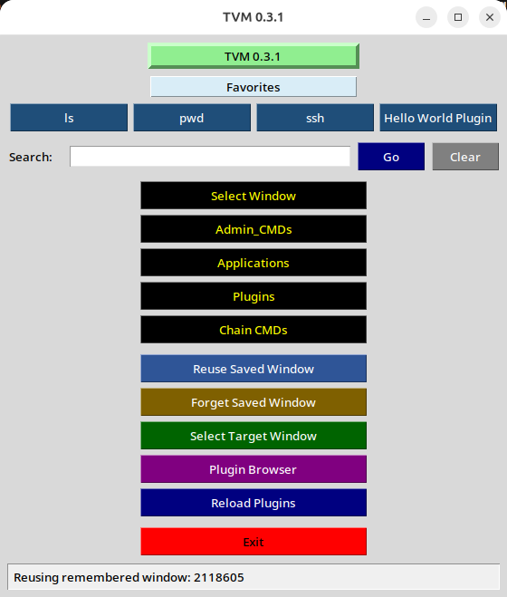
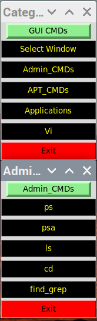
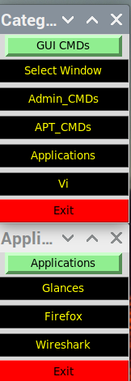
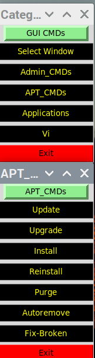
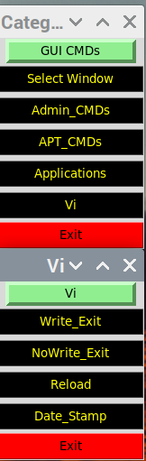

# TVM — Terminal Virtual Macropad


-lightgrey)


TVM is a lightweight **Tkinter-based command launcher** for Linux (Xorg) that lets you send commands directly to any terminal window or spawn new ones.

It acts like a **virtual macropad for your terminal**.

---

## 📸 Screenshots

### Main Window



### Admin Commands



### Applications



### APT Commands



### VI Commands



---

## ✨ Features

* 🖱️ Select any X11 window as a command target
* ⌨️ Send commands directly into an existing terminal
* 🧩 Plugin system with hot reload
* 🧠 Smart placeholders like `<path>`, `<user>`, `<host>`
* 🔐 Optional confirmation for dangerous commands
* 📂 Organized categories and subcommands
* 📊 Status bar feedback

---

## 📦 Installation

```bash
git clone https://github.com/cmora111/tvm
cd tvm
python3 -m venv .venv
source .venv/bin/activate
pip install -e .
```

Run:

```bash
tvm
# or
python -m tvm
```

---

## 🧰 Requirements

```bash
sudo apt install xdotool x11-utils
```

---

## 🚀 Usage

1. Select a target window
2. Click a command
3. Done

---

## 🧠 Placeholders

```bash
cd <path>
ssh <user>@<host>
```

TVM prompts you automatically.

---

## 🔐 Confirmation Example

```python
'Danger Upgrade': [2, 'sudo apt upgrade -y', {'confirm': True}]
```

---

## ⚙️ Configuration

```bash
~/.config/tvm/config.py
```

See `examples/config.py`.

---

## 🔌 Plugins

Location:

```bash
~/.config/tvm/plugins/
```

Example:

```python
def run(app, context):
    app.send_text_to_window('echo "Hello from plugin!"')
```

---

## ⚠️ Notes

* Requires **Xorg (not Wayland)**
* Uses `xdotool` + `xwininfo`

---

## 🧼 Cleanup

See `CLEANUP.md`

---

## 📌 Roadmap

* Multi-field input form
* Command search
* Favorites
* Config editor UI

---

## 📄 License

MIT

---

## 🙌 Author

Carlos Mora
https://github.com/cmora111

