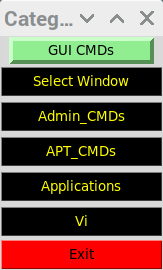

Requirements:

```
python3-tk
git://github.com/rshk/python-libxdo
```
# tvm.py

tvm.py: Is a  python script that uses tkined to simulate a macropad. A configuration file is used to create labels and commands for each label.

An example configuration file ***src/tvm_config.py***:
```
debug = { "Flag": "False" }

# For other linux terminals (Ubuntu)
terminal = { "application": "gnome-terminal" }
# For raspberryy pi)
#terminal = { "application": "lxterminal" }

Categories = {
    "Select Window": {
        "Select window": [0, "None"]
    },
    "Admin_CMDs":  {
        "ps": [1, "ps axwwl"],
        "psa": [2, "ps axwwl|grep -i <name>"],
        "ls": [2, "ls <name>"],
        "cd": [2, "cd <name>"],
        "find_grep": [2, "find . -type f -exec grep -i <name> {} \; -print"],
    },
    "APT_CMDs": {
        "Update": [2, "sudo apt update"],
        "Upgrade": [2, "sudo apt upgrade -y"],
        "Install": [2, "sudo apt install <name>"],
        "Reinstall": [2, "sudo apt install -y --reinstall <name>"],
        "Purge": [2, "sudo apt purge -y <name>"],
        "Autoremove": [2, "sudo apt autoremove -y"],
        "Fix-Broken": [2, "sudo apt --fix-broken install -y"]
    },
    "Applications": {
        "Glances": [1, "glances"],
        "Firefox": [3, "firefox &"],
        "Wireshark": [3, "sudo /usr/bin/wireshark  &"]
    },
    # You can issue vi commands
    "Vi": {
        "Write_Exit": [2, ":wq!\^M"],
        "NoWrite_Exit": [2, ":q\^M"],
        "Reload": [2, ":e!\^M"],
        "Date_Stamp": [2, "!!date\^M"]
    }
}
```
###Main Screen


###Main Screen and Admin_CMDs Screen


###Main Screen and APT_CMDs Screen


###Main Screen and Applications Screen


###Main Screen and Vi Commands

